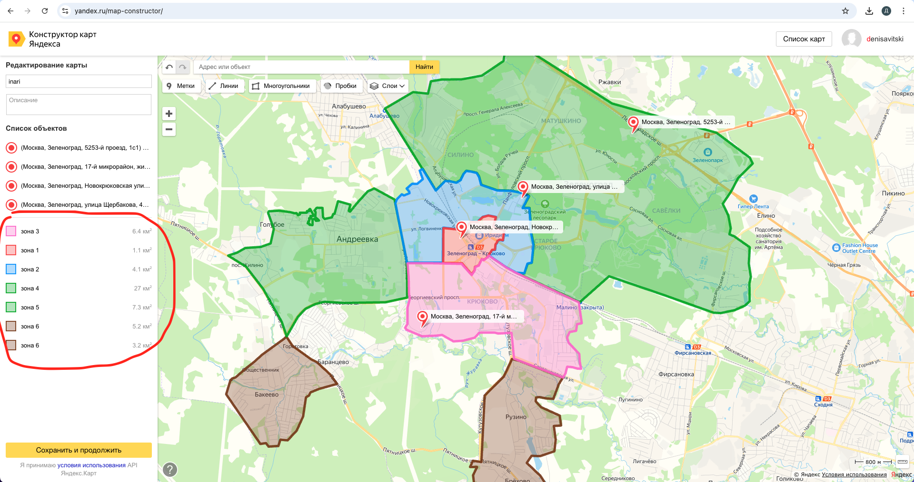
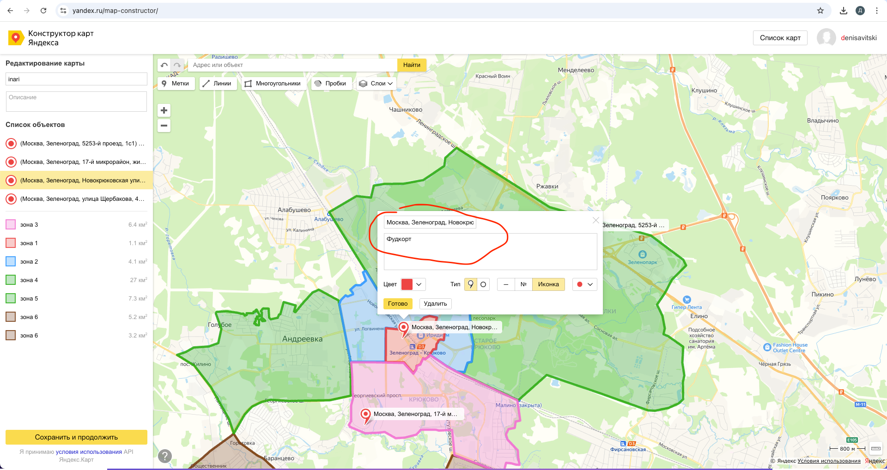
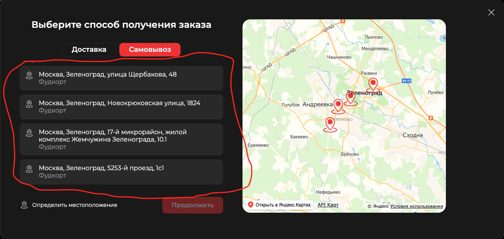

# Карта

## Конструктор

Карта редактируется и выгружается [отсюда](https://yandex.ru/map-constructor/).

Если необходимо будет что-то добавить/поменять на карте, то [этот](../../public/map.geojson) файл нужно будет импортировать в [конструктор](https://yandex.ru/map-constructor/), внести правки и выгрузить геоданные в таком же формате, после чего заменить [этот](../../public/map.geojson) файл на измененный.

В конструкторе у всех зон есть названия, они должны соответствовать названиям которое используются в элементах `<e-delivery-zone></<e-delivery-zone>`(о них ниже написано).

</img>

Также в констукторе есть точки самовывоза, названия и описания которых используются для построения разметки.

Данные отсюда

</img>

Передаются сюда

</img>

## Зоны доставки

В разметке есть элементы, данные из которых используются для определения цены доставки для указанного юзером адреса. Выглядят они вот так:

```html
<e-delivery-zone
  class="visually-hidden"
  name="зона 1"
  description="Бесплатная доставка при заказе от 1300р. с учётом скидок"
  addition="При меньшей сумме заказа доставка платная - 300 руб."
  free="1300"
  price="300"
></e-delivery-zone>
```

- `name` - Название зоны. Должно быть таким же как в конструкторе. Если в name указано UNKNOWN, то эта зона будет использоваться если адрес юзера не попадает ни в одну другую.
- `description` и `addition` - Описания которые показываются юзеру после указания адреса.
- `free` и `price` - в версии для modx мной нигде не используются, но наверное вам пригодятся.

Зона юзера и ее описание находятся в [глобальном хранилище](../globalStore.md), доступ к которой можно получить вот так:

```js
console.log(globalStore.delivery.userZone)
```

После того как юзер вводит/меняет адрес или переключается между способами заказа,`userZone` меняет свое значение, отследить это можно подписавшись на изменения:

```js
globalStore.delivery.subscribe((e) => {
  console.log(e, globalStore.delivery.userZone)
})
```
